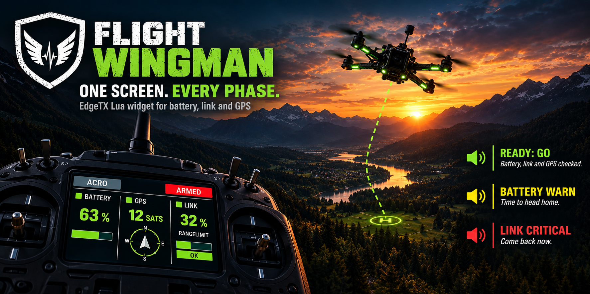
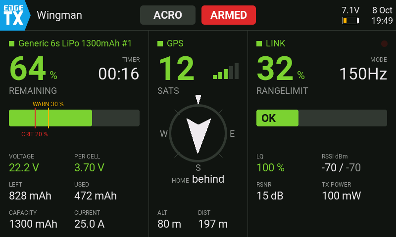
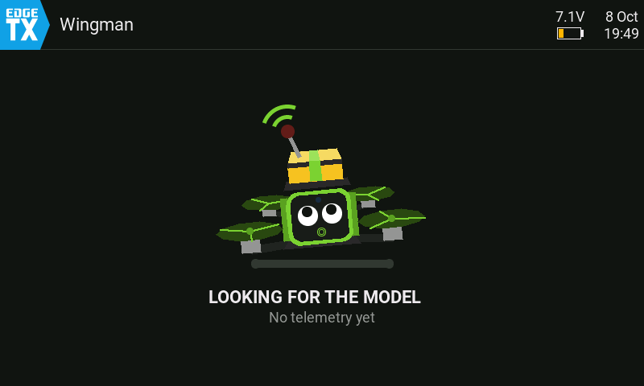
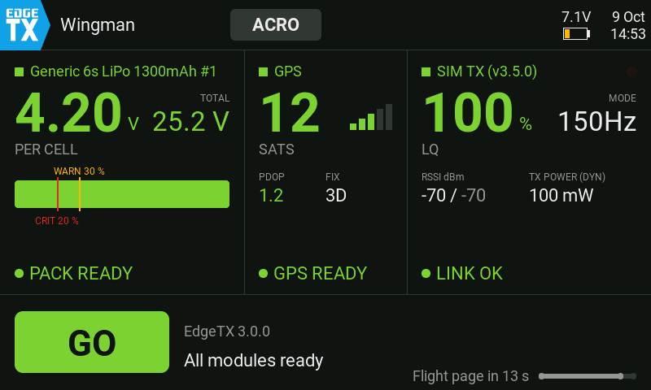
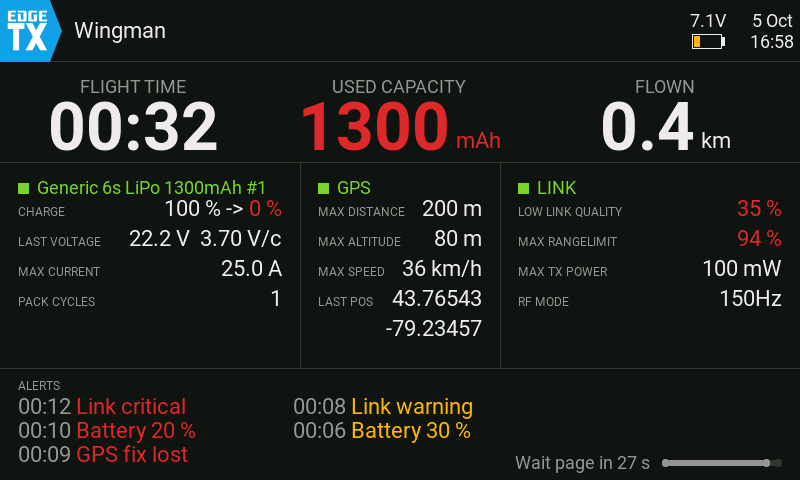
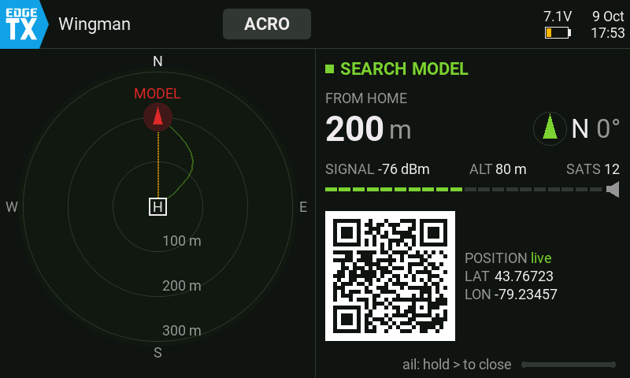

# edgetx-flight-wingman



Flight Wingman brings **battery, radio link and the way home together on one screen**: a full-screen EdgeTX widget that shows the right page for each phase of a flight, from plugging in the battery to finding the model after a crash. It builds on [Lipo Nanny](https://github.com/Mariator-pro/edgetx-lipo-nanny), [Link Sentinel](https://github.com/Mariator-pro/elrs-link-sentinel) and [GPS Homer](https://github.com/Mariator-pro/edgetx-gps-homer) and ships with all three.

[](LICENSE)
[](https://edgetx.org)
[](https://www.expresslrs.org)
[](../../issues)
[](../../commits/main)
[](https://www.buymeacoffee.com/mariatorpro)

---

## 📑 Table of Contents

- [📋 Compatibility](#-compatibility)
- [🎯 What is it for?](#-what-is-it-for)
- [🧰 Requirements](#-requirements)
- [📥 Installation](#-installation)
- [⚙️ Customizing](#️-customizing)
- [🛠️ Troubleshooting](#️-troubleshooting)
- [🤝 Contributing](#-contributing)
- [⚠️ Disclaimer](#️-disclaimer)
- [📄 License](#-license)

---

## 📋 Compatibility

> [!CAUTION]
> **Testing is not finished yet.** The project is in an early stage and has not been through all real-flight tests. Feedback on how the individual functions behave on your setup is very welcome, please [open an issue](../../issues).

| Component | Minimum Version | Tested On | Test Hardware |
|-----------|-----------------|-----------|---------------|
| EdgeTX    | v2.11           | v2.12.4   | Radiomaster TX15, Radiomaster TX16S MK3 |
| ExpressLRS| v4.0.0          | v4.1.0    | Radiomaster RP1 V2, RP3 V2, RP4TD |

> Battery, link and GPS work exactly as in the three single projects, so their compatibility notes apply here too: [Lipo Nanny](https://github.com/Mariator-pro/edgetx-lipo-nanny/blob/main/docs/compatibility.md), [Link Sentinel](https://github.com/Mariator-pro/elrs-link-sentinel/blob/main/docs/compatibility.md), [GPS Homer](https://github.com/Mariator-pro/edgetx-gps-homer/blob/main/docs/compatibility.md).
>
> Flight Wingman itself reads the flight mode (`FM`) from the flight controller to tell when the model is armed. Betaflight and INAV also report arming blocks and board info over MSP; ArduPilot works without them.

---

## 🎯 What is it for?

Three widgets side by side share a small screen, yet each phase of a flight needs different values. Flight Wingman sorts by phase instead of by topic: before take-off it answers *"Am I ready to go?"*, in flight *"Do I have to react now?"*, after landing *"Did everything go well?"* and after a crash *"Where is the model?"*.

<p align="center">
  
</p>

- **One screen, three columns:** battery from Lipo Nanny, home arrow from GPS Homer, link from Link Sentinel, each with the same colors and thresholds as the single widget.
- **Pages switch on their own**, no button needed: waiting, preflight, flight, post-flight and search.
- **All warnings stay as they are:** the voice announcements and vibration of the three projects keep running, even when the widget is not on screen. Flight Wingman adds no warnings of its own.
- **One ready check before take-off:** `GO` when battery, link and GPS are fine and the flight controller allows arming, otherwise `CHECK` with the reason (Betaflight and INAV name the arming block in plain text).
- **Setup errors show up before you fly:** a missing core, an unconfigured model or a missing sensor keeps the waiting page with a hint, instead of warnings silently not playing.
- **Not every model has GPS:** battery, link and GPS can be switched off per model; the remaining columns share the width.

Besides the flight view above, the widget shows a page for each other phase of a flight:

<table>
  <tr>
    <td align="center"></td>
    <td align="center"></td>
  </tr>
  <tr>
    <td align="center"><b>Waiting</b><br>no telemetry yet</td>
    <td align="center"><b>Preflight</b><br>pack selection and ready check</td>
  </tr>
  <tr>
    <td align="center"></td>
    <td align="center"></td>
  </tr>
  <tr>
    <td align="center"><b>Post-flight</b><br>the flight's summary and alerts, 30 s</td>
    <td align="center"><b>Search</b><br>after landing far from home</td>
  </tr>
</table>

Meet **Quad**, the Wingman mascot: it keeps you company on the waiting page and looks sad when something in the setup needs your attention.

<p align="center">
  
</p>

---

## 🧰 Requirements

- A **color-display radio** running **EdgeTX 2.11 or newer** (800×480 and 480×272/320 screens).
- A **flight controller** (Betaflight; INAV and ArduPilot untested) with telemetry enabled, so the radio gets the `FM` sensor. GPS is optional.
- An **ExpressLRS receiver (4.0 or newer)** with telemetry enabled. Set the telemetry ratio faster than `Std` (for example 1:16): with `Std` the flight mode arrives only every 6 to 8 s, so the flight page appears late after arming.
- The telemetry sensors of the three projects, found by a **telemetry discovery** (Model Settings → Telemetry → "Discover new sensors"). Which ones are needed: see the requirements of [Lipo Nanny](https://github.com/Mariator-pro/edgetx-lipo-nanny#-requirements), [Link Sentinel](https://github.com/Mariator-pro/elrs-link-sentinel#-requirements) and [GPS Homer](https://github.com/Mariator-pro/edgetx-gps-homer#-requirements).

---

## 📥 Installation

### 1. Copy the files to the SD card

Copy the folders below 1:1 into the root of the SD card. Flight Wingman brings the cores of the three single projects along, so you don't need to install them separately.

```
SCRIPTS/
├── WINGMAN/                ← Wingman logic and Flight Bag settings
├── LIPONY/                 ← battery logic (Lipo Nanny)
├── SNTNL/                  ← link logic (Link Sentinel)
├── GPSHOMER/               ← GPS logic (GPS Homer)
├── FLIGHTBAG/              ← Flight Bag pages
└── TOOLS/
    └── FLIGHTBAG.lua       ← Tools menu entry
WIDGETS/
└── WINGMAN/
    └── main.lua            ← widget
SOUNDS/
└── en/
    └── SCRIPTS/            ← all .wav files of the three projects
```

The sound files always live under `/SOUNDS/en/SCRIPTS/`, no matter which language your radio is set to. `config.lua` files are written by the radio once you save settings, nothing you copy.

> **Already using one of the single projects?** Its files are the same; a newer version on the card is fine as long as it fits (otherwise Flight Bag shows `core too old` in the Wingman popup).

### 2. Set up the widget

1. Open the model's **Telemetry / Display** setup (the page where you arrange the widget screens).
2. Choose the **App mode** layout (one zone over the whole screen, no EdgeTX top bar). Flight Wingman draws its own header with model name, flight mode, `ARMED`, radio battery and time.
3. Add a widget to the zone and choose **Wingman** from the list.
4. *(Optional)* Open the widget settings to adjust the look:
   - **Theme**: `Dark` or `Light`.
   - **Compass**: `NoseUp` (default): flight direction on top, the arrow points home. `NorthUp`: north on top like a map, an `H` on the ring marks home.
   - **Transparency**: how much of the radio theme shows through the milky background (light theme only): `0%` opaque, `100%` no overlay.
   - **Accent**: color of the heading text: `Default` (green), `Theme` (the focus color of your EdgeTX theme) or `Custom` (pick any color under **AccentColor**).

> ⚠️ **Don't combine Flight Wingman with the single widgets or function scripts** of Lipo Nanny, Link Sentinel or GPS Homer on the same model, otherwise every announcement plays twice. Place Flight Wingman on **one screen only**.

### 3. Set up the projects

Open **SYS → Tools → Flight Bag** and set up battery, link and GPS as described for the single projects (at least one battery profile and the model settings in Lipo Nanny). An icon with a warning sign tells you what is still missing.

### 4. Try it out

- Plug in the battery: the preflight page shows battery, GPS and link. Pick the pack if several fit, the same way as in [Lipo Nanny](https://github.com/Mariator-pro/edgetx-lipo-nanny/blob/main/docs/usage.md). Once everything is ready, the field shows `GO` and a bar counts down 15 s to the flight page; arming switches at once.
- Unplug the battery after the flight: the post-flight page shows flight time, used capacity, distance, each column's extremes and the flight's alerts for 30 s.
- Landed or crashed far from home (more than 15 m)? The search page shows where the model is, with a QR code for your phone's map app. While the link is still up, the radio beeps like a Geiger counter (higher and faster the stronger the signal), so you can walk towards the model without looking at the screen.

### Stick controls

Touch and keys don't reach a widget in App mode, so Flight Wingman uses the sticks, and only while disarmed:

- **Pack selection:** elevator moves the cursor, aileron held right for 1 s confirms.
- **Close the search page:** aileron held right for 1 s.
- **Show the last post-flight page again:** on the waiting page, aileron held left for 1 s.

---

## ⚙️ Customizing

All settings are made in **Flight Bag**, the settings tool shared by all four projects (**SYS → Tools → Flight Bag**). Thresholds, sounds and vibration belong to the single projects and work exactly as described there: [Lipo Nanny](https://github.com/Mariator-pro/edgetx-lipo-nanny/blob/main/docs/configuration.md), [Link Sentinel](https://github.com/Mariator-pro/elrs-link-sentinel#️-customizing), [GPS Homer](https://github.com/Mariator-pro/edgetx-gps-homer#️-customizing).

Flight Wingman adds four settings:

- **Models → Show in Wingman**: switch **Battery**, **Link** and **GPS** on or off per model (default all on). A switched-off column stays empty, is left out of the ready check and frees its space for the others.
- **Display → Mascot**: the character on the waiting page, `Quad` (default) or `Scout`.
- **Display → Flight time**: the small value beside the battery percentage on the flight page, `EdgeTX Timer 1` (default, the model's Timer 1) or `Remaining Timer` (Lipo Nanny's estimate of the remaining flight time, `calc..` for the first 30 s of flying).
- **Display → GPS view**: what the GPS column of the flight page shows, `Compass` (default) or `Horizon`: an artificial horizon from the flight controller's pitch and roll, with roll and pitch as numbers, the heading on a band above it and a house on the band towards home. The GPS column gets a little wider for it. The horizon shows the last pitch and roll that arrived, so it follows the model only with a fast telemetry ratio: set **Telem Ratio** in the ExpressLRS Lua script to 1:4 or faster (with `Std` it moves only every few seconds). Without pitch and roll sensors it shows `NO ATTITUDE`.

---

## 🛠️ Troubleshooting

- **Waiting page with a sad mascot and "Configuration error / Please check Tool Flight Bag":** Something is not set up yet. Open **Tools → Flight Bag**; the icon with the warning sign names the problem in its popup.
- **"Core missing / Reinstall Flight Wingman":** `/SCRIPTS/WINGMAN/core.lua` is not on the card. Copy the folders again.
- **The flight page comes several seconds after arming:** The telemetry ratio is set to `Std`. Set it faster, for example 1:16.
- **Every announcement plays twice:** A single widget or function script of the three projects is still active on this model. Remove it.
- Problems in one column: see the troubleshooting of [Lipo Nanny](https://github.com/Mariator-pro/edgetx-lipo-nanny/blob/main/docs/troubleshooting.md), [Link Sentinel](https://github.com/Mariator-pro/elrs-link-sentinel#️-troubleshooting) or [GPS Homer](https://github.com/Mariator-pro/edgetx-gps-homer#️-troubleshooting).

---

## 🤝 Contributing

Found a bug or have an idea for an improvement? Please [open an issue](../../issues) on GitHub. Pull requests are welcome too. Changes to battery, link or GPS logic belong in the matching single project.

---

## ⚠️ Disclaimer

This project is provided **as is** and is meant as an additional aid only. It does **not** replace careful flying within visual range, your own judgement, your own battery management, GPS rescue on the flight controller, or the safety mechanisms of your transmitter and receiver. Always be ready to react manually. Use at your own risk.

---

## 📄 License

Released under the [GNU General Public License v2.0](LICENSE).
